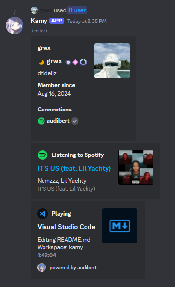

# 🧩 Discord Bot with Rich Presence Embeds

## Invite the Bot

To invite the bot to your server, use the following link: [Invite the Bot](https://discord.com/oauth2/authorize?client_id=1315480992835698821&permissions=536872960&integration_type=0&scope=bot)

## Description

This Discord bot uses the **Audibert API** (`api.audibert.rest/user/:useid`) to generate personalized user profiles quickly and easily, displaying information in organized, visually appealing embeds. It fetches your profile, what you're listening to on Spotify, and your current activities, making it perfect for showcasing user activity, status, and presence in communities or streams.

## Example Response

The bot retrieves your profile, what you're listening to on Spotify, and your current activities, displaying all of this information in a beautifully structured embed.

## Note

To generate the profile of any person, they must be in the **Audibert server**. You can join the server using this link: [https://discord.gg/QaHyQz34Gq](https://discord.gg/QaHyQz34Gq)
